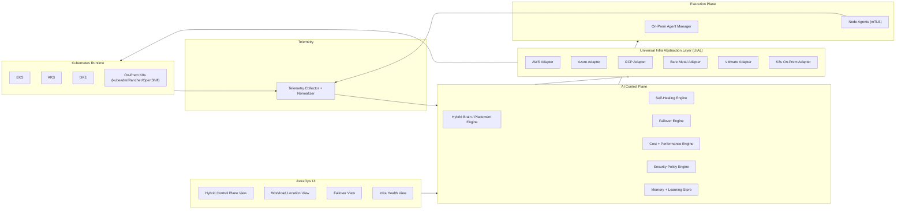

# ASTRAOPS Hybrid + Multi-Cloud Architecture

## 1) Hybrid Architecture Diagram

## 2) UIAL Interfaces + Adapters

### Mandatory interfaces (implemented)
- `ComputeService`
- `StorageService`
- `NetworkService`
- `KubernetesService`
- `IAMService`

Each supports `create`, `delete`, `update`, `scale`, `monitor`.

### Source of truth
- Interfaces: `backend/src/modules/uial/uial.types.ts`
- Registry: `backend/src/modules/uial/uial.registry.ts`
- Service API: `backend/src/modules/uial/uial.service.ts`
- Routes: `backend/src/modules/uial/uial.routes.ts`

### Cloud adapters
- AWS: `backend/src/modules/uial/adapters/aws.uial.adapter.ts`
- Azure: `backend/src/modules/uial/adapters/azure.uial.adapter.ts`
- GCP: `backend/src/modules/uial/adapters/gcp.uial.adapter.ts`

### On-prem adapters
- Bare metal: `backend/src/modules/uial/adapters/baremetal.uial.adapter.ts`
- VMware: `backend/src/modules/uial/adapters/vmware.uial.adapter.ts`
- On-prem Kubernetes: `backend/src/modules/uial/adapters/k8s-onprem.uial.adapter.ts`

## 3) On-Prem Agent Architecture

### Agent model
- Lightweight agent per node/server
- Command protocol with statuses (`PENDING -> RUNNING -> SUCCEEDED/FAILED`)
- Event stream + heartbeats
- Datacenter-aware command broadcast

### Source
- Types: `backend/src/modules/onprem-agent/agent.types.ts`
- Manager: `backend/src/modules/onprem-agent/agent.manager.ts`
- Service: `backend/src/modules/onprem-agent/agent.service.ts`
- Routes: `backend/src/modules/onprem-agent/agent.routes.ts`

### Command examples
- `DEPLOY_CONTAINER`
- `RESTART_SERVICE`
- `SCALE_WORKLOAD`
- `DRAIN_NODE`
- `FAILOVER_INITIATE`

## 4) Kubernetes Multi-Cluster Runtime

ASTRAOPS treats Kubernetes as the universal runtime:
- Cloud: EKS / AKS / GKE
- On-prem: kubeadm / Rancher / OpenShift via on-prem adapter

UIAL Kubernetes interface handles deploy/update/scale/monitor across all providers through one contract.

## 5) Failover Logic (Autonomous)

### Triggered events
- On-prem node crash
- VMware host failure
- K8s node not ready
- Cloud region outage
- Latency spike / error-rate breach

### Autonomous phases
`DETECTED -> ANALYZING -> DRAINING -> REDIRECTING_TRAFFIC -> DEPLOYING_TARGET -> VERIFYING -> COMPLETED`

### Source
- Engine: `backend/src/modules/hybrid-failover/failover.engine.ts`
- Service: `backend/src/modules/hybrid-failover/failover.service.ts`
- Routes: `backend/src/modules/hybrid-failover/failover.routes.ts`

## 6) AI Decision Engine (Placement Brain)

### Decision objective
Choose best placement across cloud + on-prem using:
- compliance/data-locality hard rules
- health and capacity
- latency sensitivity
- burstability
- cost optimization
- historical learning bias

### Source
- Placement engine: `backend/src/modules/hybrid-brain/placement-engine.ts`
- Brain service: `backend/src/modules/hybrid-brain/hybrid-brain.service.ts`
- Types: `backend/src/modules/hybrid-brain/hybrid-brain.types.ts`
- Routes: `backend/src/modules/hybrid-brain/hybrid-brain.routes.ts`

## 7) Autonomous Loop

`OBSERVE -> ANALYZE -> DECIDE -> ACT -> VERIFY -> LEARN`

- Observe: telemetry collectors normalize metrics
- Analyze: hybrid brain + policy constraints
- Decide: placement/failover/self-heal action
- Act: UIAL adapter call or on-prem agent command
- Verify: health checks + SLO checks
- Learn: persist outcome in learning memory

## 8) Frontend Views

Implemented views for hybrid operations:
- `HybridControlPlaneView.tsx`
- `WorkloadLocationView.tsx`
- `FailoverView.tsx`
- `InfraHealthView.tsx`

These are available under dashboard components and can be wired into nav for operator workflows.

